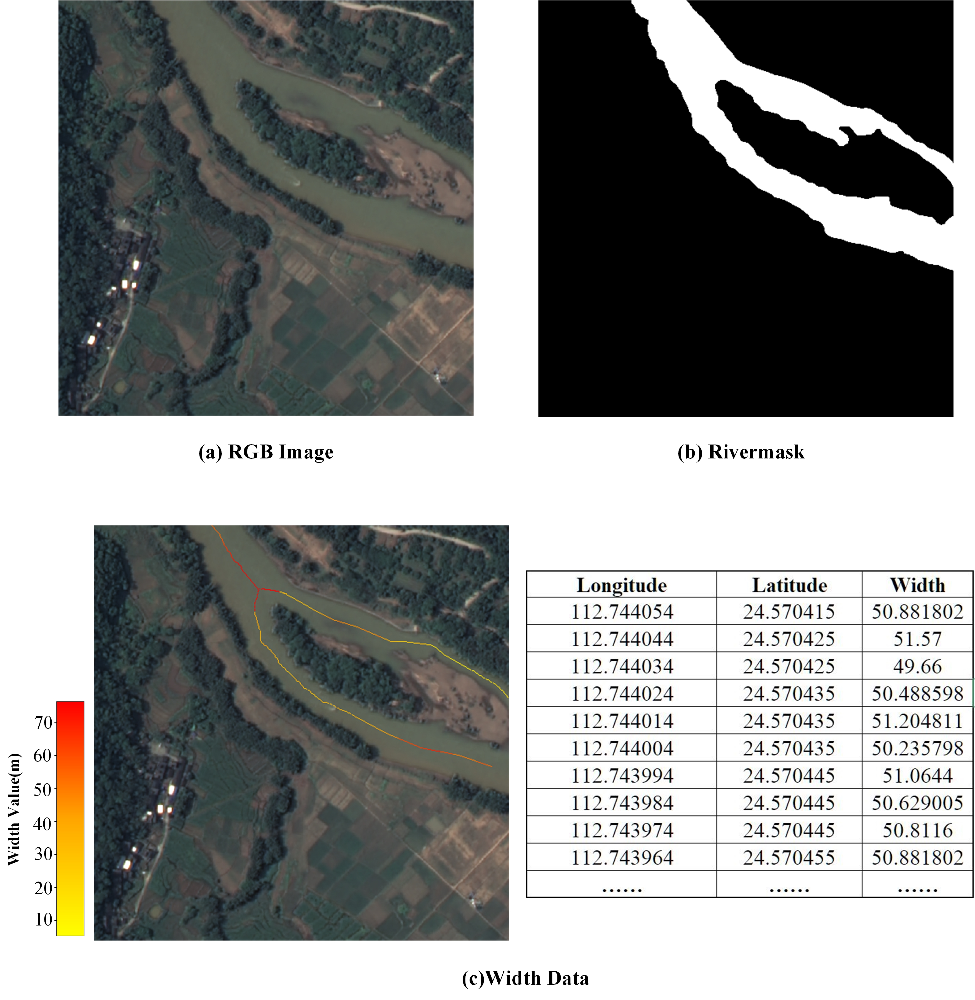

# RiverWidth-HR-Dataset

> **Important Notice**  
> 🚨 **The RiverWidth-HR Dataset will be publicly released only after the associated paper is officially published.**  
> This repository currently provides dataset documentation, structure specification, and sample access instructions.  

---

## Overview

The RiverWidth-HR Dataset is a high-resolution, geo-referenced river width dataset derived from 1 m spatial resolution GF-2 optical satellite imagery. It provides manually refined annotations, including pixel-level river masks, centerline skeletons, and river width measurements. The dataset is designed to support research in river segmentation, centerline extraction, and quantitative river width estimation from optical remote sensing imagery.

Each sample is defined as a **512 × 512 pixel image patch**. 
Spatial consistency among the imagery, masks, and width annotations is strictly ensured through coordinate-based matching.

---

## Dataset Highlights

- **Spatial Resolution:** 1 m (GF-2 optical satellite imagery)  
- **Annotation Types:**
  - RGB optical imagery (GeoTIFF)
  - Binary river masks (TIFF, 0 = background, 255 = river)
  - river width annotations (TXT, georeferenced)
- **Sample Size:** 512 × 512 pixels per patch  
- **Total Samples:** 3,040  
- **Split Ratio:** 70% training / 20% validation / 10% testing  
- **Coordinate System:** Geo-referenced (affine transform stored in GeoTIFF headers)

---

## Sample Structure

Each sample unit consists of a **“triplet”**:

1. **RGB Image Patch**  
   A 512 × 512 sub-image cropped from the original GF-2 optical imagery.

2. **River Mask Patch**  
   A binary mask covering the same spatial extent, where river pixels are labeled as 255 and background pixels as 0.

3. **River Width Annotation File**  
   A TXT file that records the geographic coordinates of all centerline points within the patch and their corresponding river width values (in meters).

---

## Illustration

### Dataset Sample Unit Structure

> *Figure 1. Illustration of a dataset sample unit consisting of an RGB image patch, a corresponding binary river mask, and georeferenced river width annotations along the extracted centerline.*

### Representative Samples

> *Figure 2. Representative samples from the RiverWidth-HR Dataset. River-width information is overlaid on GF-2 optical remote sensing imagery, covering diverse geographic settings, multiple river-width scales, and a wide range of river morphologies.*

---

## Data Generation and Quality Control

### Cropping Strategy

A **dual-offset sliding-window strategy** is adopted during sample generation to mitigate the spatial bias introduced by fixed cropping origins. This enables more diverse representations of river positions and morphologies within the image patches.

### Data Augmentation

To improve robustness to varying river orientations, **rotation-based augmentation** is applied. Samples with incomplete or severely truncated river structures are removed through a quality control process.

### Final Dataset Composition

After augmentation and filtering, a total of **3,040 high-quality sample units** are obtained. The resulting dataset covers:
- Multiple river-width scales
- Diverse geomorphological environments
- Complex channel morphologies and confluence patterns

---

## Study Areas

### Wuhan Region, Hubei Province, China

- **Geographic Extent:** 114.1°–114.4° E, 30.5°–30.7° N  
- **Characteristics:**  
  A multi-scale river system composed of major rivers, tributaries, and dense minor branches. This region supports the learning of width representations for large rivers and confluence scenarios.

- **Total Area:** ~640 km²  
- **Effective River Length:** ~134 km  

---

### Qingyuan–Shaoguan Region, Guangdong Province, China

- **Geographic Extent:** 112.66°–112.97° E, 24.46°–24.88° N  
- **Characteristics:**  
  Dominated by mountainous and hilly narrow-channel rivers, accompanied by highly sinuous small streams. This region provides strong constraints for learning width representations of rivers narrower than 30 m and highly curved riverbanks.

- **Total Area:** ~980 km²  
- **Effective River Length:** ~80.8 km  
